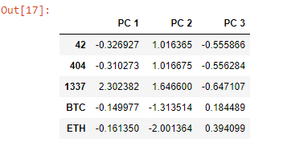
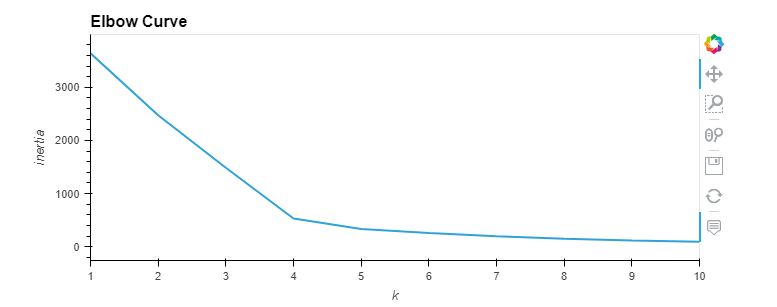
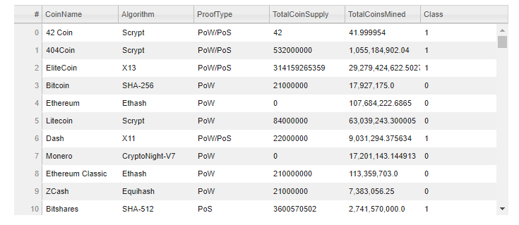
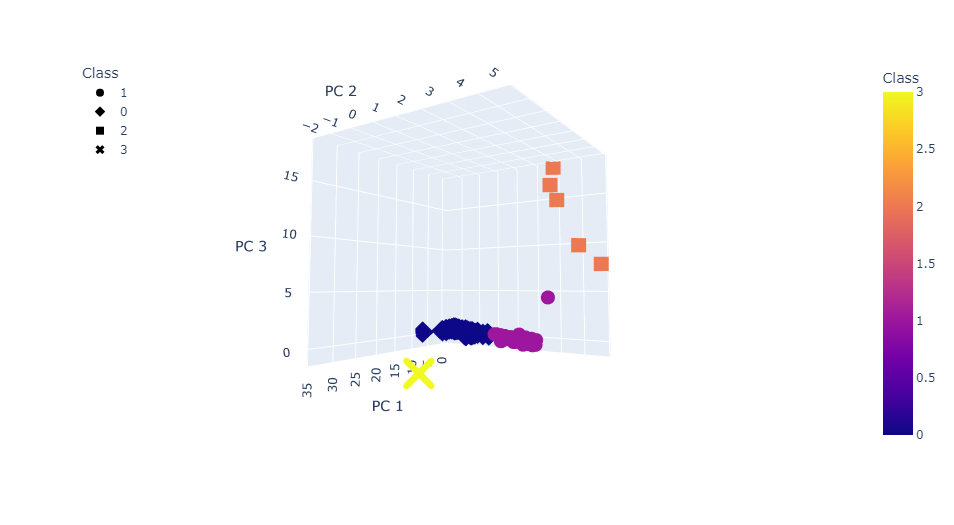
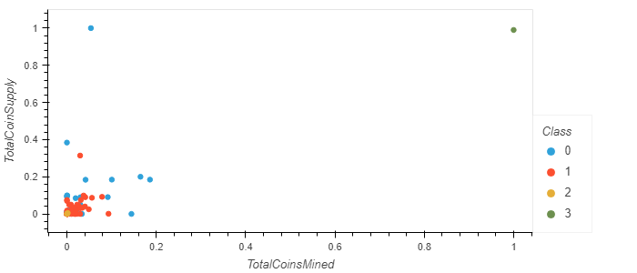

# Cryptocurrencies

## Purpose of Analysis

We are completeing an analysis for Accountability Accounting, an investment bank that wants to offer a new cryptocurrency investment portfolio for its customers. We must create a report about the current cryptopcurrencies in the market. This will provide Accountability Analysis with classifications of the cryptocurrencies. Since there are no known results, we will be using Unspervised Learning. 

- Resources
  - crypto_data.csv
  - Pandas, sklearn

In four steps, we will:
  - Preprocess the data for Principal Component Analysis (PCA)
  - Reduce the data dimensions using PCA
  - Cluster the Cryptocurrencies using K-means
  - Visual the Cryptocurrencies results 

## Results
- This is what the data looks like condensed into three Principal Component Analyses:

- After 

## Summary
